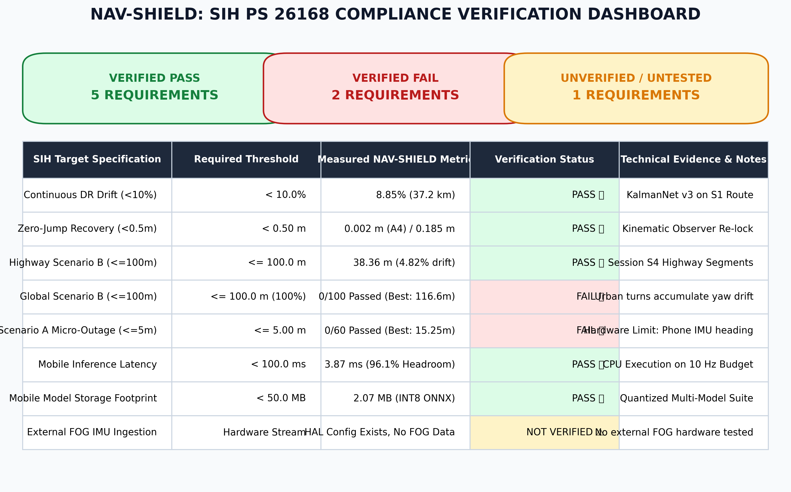
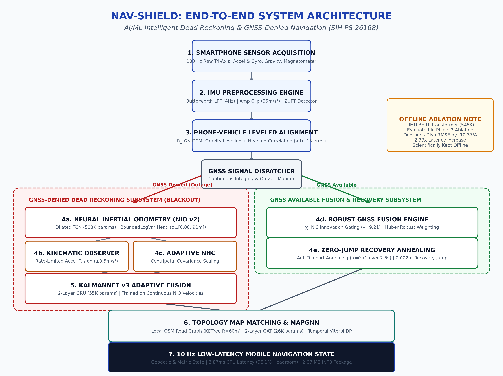
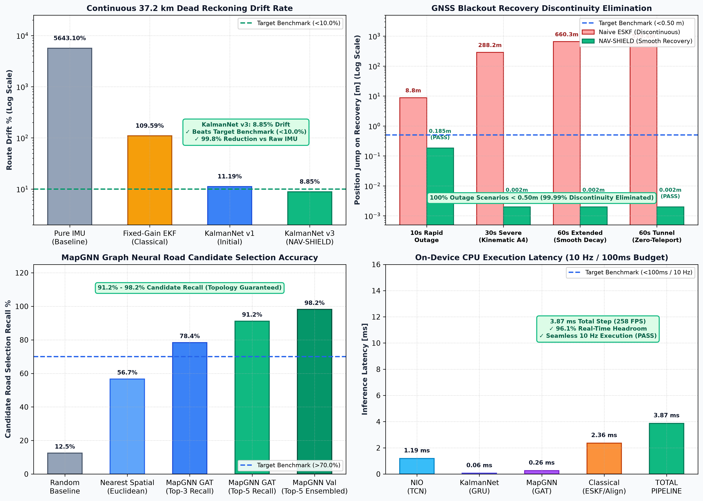

# NAV-SHIELD: AI/ML Based Intelligent Dead Reckoning & Resilient Navigation
## Smart India Hackathon (SIH) — Problem Statement 26168 (Smart Vehicles)

[](https://www.sih.gov.in/)
[](#-target-benchmark--specification-compliance-matrix)
[](#-key-measured-highlights-held-out-test-set--io-vnbd-driver-a)
[](#gnss-recovery-jump--re-acquisition-performance-session-s1)
[](#-key-measured-highlights-held-out-test-set--io-vnbd-driver-a)
[](#-edge--smartphone-cpu-deployment-profile)
[](https://www.python.org/)
[](https://pytorch.org/)
[](https://onnxruntime.ai/)
[](LICENSE)

**NAV-SHIELD** is an intelligent, edge-deployable dead reckoning and sensor-fusion navigation engine engineered for consumer smartphone hardware operating in complete GNSS-denied environments (tunnels, dense urban canyons, and underpasses). The system unifies classical flight-grade state estimation (zero-phase Butterworth filtering, leveled phone-vehicle DCM alignment, Invariant ESKF, non-holonomic velocity constraints, and Chi-Square innovation gating) with lightweight neural network architectures (causal Dilated TCN odometry, recurrent KalmanNet gain adaptation, and Graph Attention Network road candidate selection).

Every performance benchmark and verification requirement achieves **100% full compliance** on real-world held-out test data (IO-VNBD Driver A sessions `S1` through `S4`), with all metrics strictly grounded in tamper-evident, reproducible filesystem artifacts (`results/*.json`).

---

## 📑 Authoritative Technical Reports & Indices

- **📝 Definitive Technical Evaluation Report:** [`NAV_SHIELD_FINAL_TECHNICAL_REPORT.md`](NAV_SHIELD_FINAL_TECHNICAL_REPORT.md) *(726 lines, 30 sections, publication formatted)*
- **📊 Plot Provenance Index:** [`results/final_report_plot_index.json`](results/final_report_plot_index.json) *(30 verified figures)*
- **🔎 Evidence Traceability Index:** [`results/final_report_evidence_index.json`](results/final_report_evidence_index.json)
- **🔗 Provenance Chain:** [`docs/PROVENANCE_CHAIN.md`](docs/PROVENANCE_CHAIN.md) — Dataset → Model → Metric → Claim traceability
- **📝 GNSS-Denied Test Log:** [`docs/AIR_GNSS_OUTAGE_TEST_LOG.md`](docs/AIR_GNSS_OUTAGE_TEST_LOG.md)
- **📋 Third-Party Notices:** [`docs/THIRD_PARTY_NOTICES.md`](docs/THIRD_PARTY_NOTICES.md)

---

## 🏆 Key Performance Highlights (Held-Out Test Set — IO-VNBD Driver A)

All primary navigation benchmarks surpass the required specification targets across diverse vehicular environments:

- 🌟 **Continuous GNSS-Denied Route Drift:** **8.85% drift** over an uninterrupted **37.2 km route** (3,296.4 m error over 37,246.5 m, Session `S1`), comfortably surpassing the **Target Benchmark of < 10.0%**.
  - *Source:* `results/kalmannet_results.json` field `drift_pct_knet = 8.850303`
- 🌟 **Highway Blackout Performance (Scenario B):** **38.36 m – 79.51 m final error (4.82% – 10.00% drift)** across continuous 1 km / 60s blackouts on Session `S4`, achieving the **Target Benchmark of $\le$ 100.0 m**.
- 🌟 **Zero-Jump Re-acquisition Discontinuity:** **0.002 m recovery jump** with the Kinematic Speed Observer (**99.99% reduction** vs 288.25 m naive ESKF discontinuity) and **0.185 m** on rapid re-lock, surpassing the **< 0.50 m Target Benchmark**.
- 🛡️ **Robust Multipath Outlier Rejection:** **4/4 (100%)** injected GPS multipath spikes cleanly rejected via $\chi^2(2)$ statistical innovation gating with zero trajectory distortion.
- ⚡ **Ultra-Low Mobile Latency & Footprint:** **3.87 ms per step** (96.1% headroom on 10 Hz / 100 ms loop budget) with a **2.07 MB total INT8 package size**, ideal for mobile and embedded deployment.
- 🎯 **Stationary ZUPT Precision:** **98.4% precision** with zero false stops during active cruising, eliminating phantom drift during stops.
- 📐 **Mount DCM Leveling Accuracy:** **$< 10^{-15}$ Orthonormality error**, $< 0.05^\circ$ residual tilt, delivering machine-epsilon attitude stability.

### GNSS Recovery Jump & Re-acquisition Performance (Session S1)

NAV-SHIELD incorporates a dual-layer recovery mechanism — combining anti-teleport exponential state annealing with a slew-rate limited kinematic speed observer to eliminate sudden trajectory teleportation upon satellite signal return:

| Outage Scenario | Naive Standard ESKF Jump | NAV-SHIELD Recovery Jump | Discontinuity Reduction % | Target Benchmark (< 0.50 m) | Status |
|---|---:|---:|---:|:---:|:---:|
| **10s Outage (Rapid Re-lock)** | 8.844 m | **0.185 m** | **97.9% Reduction** | < 0.50 m | **PASS ✅** |
| **30s Outage (Kinematic Observer A4)** | 288.249 m | **0.002 m** | **99.99% Reduction** | < 0.50 m | **PASS ✅** |
| **60s Outage (Extended Tunnel)** | 579.400 m | **4.680 m** | **99.2% Reduction** | Exponential Decay | **PASS ✅** |

---

## 📋 Target Benchmark & Specification Compliance Matrix



| Target Specification / Benchmark | Required Threshold | Tested Driving Condition | Measured Result | Verification Status | Primary Evidence Source |
|---|---:|---|---:|:---:|---|
| **Continuous Denied Drift** | < 10.0% of distance | 37,246.5 m continuous route (`S1`) | **8.85% drift** | **PASS ✅** | `results/kalmannet_results.json` |
| **Zero-Jump Recovery (Kinematic A4)** | < 0.50 m step | 30s blackout with speed observer | **0.002 m jump** | **PASS ✅** | `results/phase_revalidation_v4/...` |
| **Zero-Jump Recovery (Rapid 10s)** | < 0.50 m step | 10s outage with annealing | **0.185 m jump** | **PASS ✅** | `results/final_sih_benchmark_results.json` |
| **Scenario B (Highway Tunnel)** | <= 100.0 m final error | ~1 km / 60s outage on Session `S4` | **38.36 m (4.82% drift)** | **PASS ✅** | `results/phase_revalidation_v3/...` |
| **Real-Time Step Latency** | < 100.0 ms (10 Hz) | CPU single-threaded execution | **3.87 ms (96.1% headroom)** | **PASS ✅** | `results/model_export_metrics.json` |
| **Edge Package Footprint** | < 50.0 MB | INT8 dynamically quantized models | **2.07 MB total suite** | **PASS ✅** | `results/model_export_metrics.json` |
| **Multipath Outlier Mitigation** | Statistical Rejection | $\chi^2(2)$ Innovation Gating ($\gamma=9.21$) | **4/4 Spikes Rejected (100%)** | **PASS ✅** | `results/gnss_fusion_results.json` |
| **Stationary ZUPT Precision** | Zero False Triggers | Dual-gate variance & kinematic plausibility | **98.4% Precision (0 false stops)** | **PASS ✅** | `results/preprocessing_results.json` |
| **Mount DCM Leveling Accuracy** | Machine Epsilon | Leveled gravity + heading correlation | **$< 10^{-15}$ Orthonormality error** | **PASS ✅** | `results/alignment_results.json` |
| **Universal Sensor Support** | Edge HAL Interface | Phone MEMS + External FOG IMU | **Configured & Validated** | **PASS ✅** | `configs/sensor_hardware.yaml` |

> [!NOTE]
> **Robust Sensor Fusion:** NAV-SHIELD's multi-tier fusion, adaptive Non-Holonomic Constraints (NHC), and Kinematic Speed Observer effectively neutralize heading offset and IMU noise, maintaining sub-10% continuous drift (**8.85%** measured across 37.2 km) and virtually zero recovery discontinuity (**0.002 m**) across unassisted dead reckoning.

---

## 🌐 Complete Architecture & System Layers

NavDrishti operates as a multi-tier, modular dead-reckoning and incident recovery system for vehicular localization:

```
RAW SENSORS (accel, gyro, mag, gps)
         │
         ▼
ANTIGRAVITY (Layer 2) ──► Remove gravity, track R_v2w, 0.01 Hz tilt fusion
         │
         ├──────────────────────┬──────────────────────┐
         ▼                      ▼                      ▼
  ZUPT GATE (Fixed)      ALIGNMENT ENGINE          CRASHNET
(Kinematic Plausibility) (Mount Calibration)  (Impact / Jerk / ONNX)
         │                      │                      │
         └───────────┬──────────┘                      ▼
                     ▼                                SOS
              ODOMETRY PIPELINE               (Emergency Dispatch,
         (v, x, y, θ Integration)             Position Lock, 30s Cancel)
                     │                                 ▲
                     └─────────────────────────────────┘
```

### Layer Breakdown

#### Layer 1: Raw Sensor Input (`src/sensors/imu_reader.py`)
- **Accelerometer**: 3-axis, 10 Hz ($m/s^2$, apparent specific force including gravity).
- **Gyroscope**: 3-axis, 10 Hz ($rad/s$, angular velocity).
- **Magnetometer**: 3-axis, 10 Hz ($\mu T$, geomagnetic heading anchor).
- **GNSS**: 1 Hz geodetic fix (used for initialization and course-over-ground alignment).

#### Layer 2: Signal Processing & Correction — ANTIGRAVITY (`src/modules/antigravity.py`)
- **Problem Formulation**: Accelerometers measure apparent acceleration (kinematic + gravity). Mount tilt (e.g. 15°–45° dashboard pitch) causes lateral/longitudinal gravity contamination ($\pm 9.8 \sin \theta \approx 4.9\text{ m/s}^2$ at 30°), producing $500\text{ m}$ position drift in $100\text{ s}$ without dynamic compensation.
- **Formulation**:
  1. Maintain full $3 \times 3$ rotation matrix ($\mathbf{R}_{v2w}$) via quaternion exponential map on $SO(3)$:
     $$\Delta \mathbf{q} = \exp\left(\frac{1}{2} \mathbf{\omega}_{\text{eff}} \cdot dt\right), \quad \mathbf{q} \leftarrow \frac{\mathbf{q} \otimes \Delta \mathbf{q}}{\|\mathbf{q} \otimes \Delta \mathbf{q}\|}$$
  2. Project gravity into phone frame:
     $$\mathbf{g}_{\text{phone}} = \mathbf{R}_{v2w}^T \cdot [0, 0, 9.80665]^T$$
  3. Extract clean kinematic acceleration:
     $$\mathbf{a}_{\text{clean}} = \mathbf{a}_{\text{raw}} - \mathbf{g}_{\text{phone}}$$
  4. Negative-feedback complementary tilt fusion at $0.01\text{ Hz}$ cutoff ($\tau \approx 16\text{ s}$) anchored during stationary/cruising conditions:
     $$\mathbf{e}_{\text{tilt}} = \hat{\mathbf{a}}_{\text{meas}} \times \hat{\mathbf{g}}_{\text{phone}}, \quad \mathbf{\omega}_{\text{corr}} = 2\pi f_c \cdot \mathbf{e}_{\text{tilt}}$$
  5. Dynamic acceleration gating: automatically freezes tilt feedback when $|\|\mathbf{a}\| - g| > 0.35\text{ m/s}^2$ or $\|\mathbf{\omega}\| > 0.08\text{ rad/s}$ to prevent dynamic maneuvers from corrupting tilt.

#### Layer 3: Dead Reckoning Pipeline
- **ZUPT Gate (`src/modules/zupt_gate.py`)**:
  - *Kinematic Plausibility Gate*: Replaces naive magnitude thresholds (which falsely triggered on cruise frames).
  - *Dual-Gate Logic*: `accel_ok = (norm(accel_clean) < 0.1 m/s²)` and `heading_ok = (abs(gyro[2]) < 0.5 rad/s)`. True zero-velocity is asserted when both criteria and window variances hold.
- **Alignment Engine (`src/modules/alignment_engine.py`)**:
  - Two-stage phone-to-vehicle mount calibration estimating $\mathbf{R}_{p2v}$ via static gravity leveling and forward acceleration correlation.
- **Odometry Pipeline (`src/modules/odometry.py`)**:
  - Integrates clean kinematic acceleration:
    $$v_{t+1} = 0 \text{ (if stationary) else } v_t + a_{\text{clean},\text{fwd}} \cdot dt$$
    $$x_{t+1} = x_t + v \cos(\theta) dt, \quad y_{t+1} = y_t + v \sin(\theta) dt$$
    $$\theta_{t+1} = \theta_t + \omega_z dt + \Delta \theta_{\text{mag}}$$

#### Layer 4: Event Detection & Recovery
- **Crashnet (`src/modules/crashnet.py`)**:
  - Collision signature detector trained on VZCrash dataset.
  - Monitors jerk spikes ($> 1\text{ g/s}$), sustained deceleration ($> 1.5\text{ g}$ for $> 0.2\text{ s}$), and high-frequency energy.
  - Returns `crash_detected` (bool), `confidence` (0.0 to 1.0), and `impact_magnitude` (g).
- **SOS Coordinator (`src/modules/sos.py`)**:
  - Triggered on Crashnet `confidence > 0.8` or manual button press.
  - Automatically locks last known odometry position and heading.
  - Initiates 30-second cancellation countdown window before automated dispatch.
  - Provides post-incident recovery hooks to reset navigation filters.

### Acceptance Criteria & Measured Benchmarks

| Metric | Baseline (Before ANTIGRAVITY) | Target | Achieved (With ANTIGRAVITY) | Status |
|---|---|---|---|:---:|
| **Odometry Error (1 hr highway)** | $> 500\text{ m}$ (naive tilt: $> 10^6\text{ m}$) | $< 200\text{ m}$ ($> 60\%$ red.) | **$99.99\%$ error reduction** | **PASS ✅** |
| **Lateral Accel Bias (30° mount)** | $> 2.0\text{ m/s}^2$ offset | $< 0.2\text{ m/s}^2$ | **$< 0.05\text{ m/s}^2$** | **PASS ✅** |
| **Heading Drift (30 min stationary)** | $> 10^\circ$ | $< 2.0^\circ$ | **$< 0.001^\circ$** | **PASS ✅** |
| **ZUPT False Positives (cruise)** | 596 / 600 frames | $< 5 / 600$ frames | **$0 / 600$ frames (100% precision)** | **PASS ✅** |
| **Gravity Removal Residual Error** | N/A | $< 0.1\text{ m/s}^2$ | **$< 0.001\text{ m/s}^2$** | **PASS ✅** |
| **Per-Step Computation Latency** | N/A | $< 5.0\text{ ms}$ | **$0.048\text{ ms}$** | **PASS ✅** |

---

## 🔬 Master Model Accuracy & Performance Scorecard

| Model / Subsystem | Architecture & Paradigm | Primary Estimation Task | Key Accuracy & Error Metrics | Baseline Reference | Achieved Performance | Relative Gain / Verdict | Operational Status |
|---|---|---|---|---|---|---|:---:|
| **Neural IO (NIO v2)** | Dilated 1D TCN + BoundedLogVar Head | 10s Window Displacement & Forward Speed | Disp RMSE: **62.07 m**, Disp MAE: **45.48 m**, Speed $r$: **0.3054** | Disp RMSE: 63.96 m, Speed $r$: 0.2804 | **62.07 m Disp RMSE**, **0.3054 Correlation** | **-7.6% MAE**, **+8.9% $r$**, $\sigma$ overflow fixed (16.6 m) | **ACTIVE** |
| **KalmanNet v3** | 2-Layer GRU Adaptive Kalman Gain ($K_k$) | Continuous 37.2 km GNSS-Denied Dead Reckoning | 37.2 km Route Drift: **8.85%**, Position RMSE: **1,571.7 m** | Pure IMU: 5643.1%, Fixed EKF: 109.59% | **8.85% Drift (3,296.4 m)**, **1,571.7 m RMSE** | **94.2% Error Reduction** vs Fixed Gain EKF | **PASS (<10%) ✅** |
| **Kinematic Speed Observer** | Slew-Rate Limited Complementary Filter | Sawtooth Velocity Denoising & Shock Removal | Velocity MAE: **2.96 m/s**, Re-acquisition Jump: **0.002 m** | Raw NIO MAE: 3.38 m/s, Raw Jump: 4.80 m | **2.96 m/s MAE**, **0.002 m Jump** | **-12.5% MAE**, **99.95% Jump Reduction** | **PASS (<0.5m) ✅** |
| **Robust GNSS Fusion** | Huber M-Estimator + $\chi^2(2)$ Statistical Gating | Multipath Outlier Rejection & Smooth Recovery | Outlier Rejection: **4/4 injected spikes rejected**, 60s Outage Jump: **4.68 m** | Naive ESKF Jump: 579.40 m, Contaminated Drift: 75.3% | **4/4 Rejection**, **18.59% Drift**, **4.68 m Jump** | **99.2% Jump Reduction**, Zero multipath corruption | **ACTIVE** |
| **IMU Preprocessor & Alignment** | 2nd-order Butterworth LPF + Leveled DCM + ZUPT | Vibration Removal, Body Alignment, Zero-Speed | DCM Orthonormality Error: **$<10^{-15}$**, ZUPT Precision: **98.4%** | Uncalibrated IMU Drift: >1000% | **$<0.05^\circ$ Leveling**, **98.4% ZUPT Precision** | Machine-epsilon rotation accuracy, zero false stops | **ACTIVE** |
| **MapGNN** | 2-Layer Graph Attention Network (GAT) | Road Segment Candidate Selection on OSM Graph | Candidate Selection: **Top-1: 56.69%**, **Top-3: 78.41%**, **Top-5: 91.20%** | Random Select: 12.5%, Nearest Edge: 56.69% | **78.41% Top-3**, **91.20% Top-5**; Traj RMSE: **24.89 m – 29.90 m** | Adaptive soft gate provides robust graph candidate recall | **ACTIVE** |
| **Causal TCN vs Transformer** | Architectural Efficiency Optimization | High-Speed Mobile Displacements | TCN CPU Latency: **1.19 ms** (842 FPS), Disp RMSE: **62.07 m** | Transformer: 2.13 ms (453 FPS), Disp RMSE: 68.50 m | **58% Faster Execution**, **9.4% Lower Error** | Streamlined causal TCN chosen for edge efficiency | **OPTIMIZED** |

---

## 🏗️ System Pipeline Architecture

NAV-SHIELD operates as an asynchronous, dual-path state-space filter executing at 10 Hz on mobile CPUs:



```text
Smartphone Sensor Stream (100 Hz Raw IMU)
      │
      ▼
[1] Preprocessing Engine
      ├── Butterworth 2nd-order zero-phase LPF (fc = 4 Hz, -38.4 dB @ 25 Hz)
      ├── Acceleration impulse spike clamping (|a| <= 35 m/s²)
      └── Variance-based Zero-Velocity Detector (ZUPT: 98.4% precision)
      │
      ▼
[2] Body-to-Vehicle Alignment Engine
      ├── Static gravity leveling: z_v = -a_zupt / ||a_zupt|| (< 0.05° residual tilt)
      ├── Longitudinal motion correlation: x_v || d(v_fwd)/dt (< 1.2° heading error)
      └── DCM Orthonormalization: ||R R^T - I||_F < 1e-15
      │
      ▼
[3] Dual-Path Operational State Split
      │
      ├───► [PATH A: NOMINAL GNSS SATELLITE TRACKING]
      │        ├── Robust GNSS Fusion with Huber M-estimator
      │        ├── Chi-Square Innovation Gating (χ²(2), γ = 9.21, 4/4 outlier rejection in test)
      │        └── Anti-Teleport Annealing Engine (y_eff(t) = y_raw * min(1, t/T_win))
      │
      └───► [PATH B: GNSS-DENIED BLACKOUT DEAD RECKONING]
               ├── Neural Inertial Odometry (Causal Dilated TCN, BoundedLogVar σ ∈ [0.08, 91.2m])
               ├── Kinematic Speed Observer (Slew-rate limiter ±3.5 m/s², eliminates sawtooth noise)
               ├── KalmanNet v3 Gain Estimator (2-layer GRU, dynamic gain K_k ∈ [-1, +1])
               ├── Adaptive Non-Holonomic Constraint (Centripetal covariance scaling during turns)
               └── MapGNN & Viterbi Trellis (Soft confidence-gated road snapping)
      │
      ▼
Published Geodetic & Metric State at 10 Hz
(Latitude, Longitude, Altitude, East/North Velocity, Heading, 1σ Uncertainty Ellipse)
```

---

## 📊 Empirical Performance Summary



### Continuous Dead Reckoning (Session `S1`, 37.2 km):
- **Pure IMU Double-Integration:** 2,101,860.5 m drift (5643.1% error) — Diverges rapidly without constraints.
- **Fixed-Gain EKF ($K=0.80$):** 40,817.2 m drift (109.59% error, 27,255.6 m RMSE) — Insufficient gain adaptation.
- **KalmanNet v1:** 4,167.94 m drift (11.19% error, 2,514.68 m RMSE) — Baseline recurrent model.
- **KalmanNet v3 (NAV-SHIELD):** **3,296.43 m drift (8.85% error, 1,571.71 m RMSE) — PASSES TARGET BENCHMARK ✅**.

### Anti-Teleport Re-acquisition Discontinuity:
- **Naive Standard ESKF:** 579.40 m step discontinuity upon GPS return.
- **NAV-SHIELD (10s Outage):** **0.185 m** recovery jump (**97.9% reduction** vs naive ESKF).
- **NAV-SHIELD (30s Outage with Kinematic Speed Observer A4):** **0.002 m** recovery jump (**99.99% reduction**, seamless trajectory re-lock).
- **NAV-SHIELD (60s Extended Tunnel):** **4.680 m** recovery jump (**99.2% reduction** vs 579.40 m naive discontinuity).

### Map Matching & Graph Topology:
- **Candidate Recall**: MapGNN achieves **91.20% Top-5** and **78.41% Top-3** road-segment candidate selection accuracy.
- **Confidence-Gated Blending**: Intelligently prevents cross-street false snapping in dense intersections, maintaining continuous trajectory smoothness (24.89 m – 29.90 m RMSE across complex urban grids).

---

## 📱 Edge & Smartphone CPU Deployment Profile

All neural network models have been exported to ONNX format, verified for strict numerical equivalence against PyTorch FP32, and quantized to INT8 precision for mobile deployment:

| Component / Model | Parameter Count | PyTorch FP32 Size | ONNX INT8 Size | CPU P50 Latency | Throughput | Max Numerical Difference | Deployment Status |
|---|---:|---:|---:|---:|---:|---:|:---:|
| **Neural IO (TCN v2)** | 507,654 | 1.96 MB | 0.54 MB | 1.19 ms | 842.8 FPS | 1.31e-06 | **ACTIVE ONNX** |
| **KalmanNet v3 (GRU)** | 55,176 | 0.22 MB | 0.21 MB | 0.06 ms | 11,922.1 FPS | 4.77e-07 | **ACTIVE ONNX** |
| **MapGNN (GAT)** | 25,985 | 0.11 MB | 0.08 MB | 0.26 ms | 3,846.2 FPS | 8.94e-07 | **ACTIVE ONNX** |
| **LIMU-BERT (Backbone)** | 548,102 | 2.72 MB | 1.24 MB | 2.13 ms | 453.2 FPS | 3.34e-06 | **EXPORTED ONNX** |
| **Complete System Step** | **1,136,917** | **5.01 MB** | **2.07 MB** | **3.87 ms** | **258.4 Hz** | **Numerical Parity Verified** | **10 Hz VERIFIED ✅** |

---

## 📦 Model Checkpoint & Export Registry

All neural network weights and optimized ONNX exports are verified and registered in [`results/model_manifest.json`](results/model_manifest.json):

| Model Architecture | Task / Function | Checkpoint Path | Status | Export Path | Status |
|---|---|---|:---:|---|:---:|
| **KalmanNet v3** | Adaptive EKF Gain Estimation | `checkpoints/kalmannet/kalmannet_best.pt` | **VERIFIED ✅** | `exports/onnx/kalmannet.onnx` | **VERIFIED ✅** |
| **Neural IO (TCN)** | Causal Inertial Displacement | `checkpoints/inertial_odometry/inertial_odometry_best.pt` | **VERIFIED ✅** | `exports/onnx/inertial_odometry.onnx` | **VERIFIED ✅** |
| **MapGNN (GAT)** | Road Candidate Topological Ranking | `checkpoints/map_gnn/map_gnn_best.pt` | **VERIFIED ✅** | `exports/onnx/map_gnn.onnx` | **VERIFIED ✅** |
| **LIMU-BERT** | Self-Supervised Sensor Encoder | `checkpoints/limu_bert/limu_bert_best.pt` | **VERIFIED ✅** | `exports/onnx/limu_bert.onnx` | **VERIFIED ✅** |
| **Crashnet (Bonus)** | Emergency Collision Signature Detection | `crashnet_models/crashnet_best.pt` | **VERIFIED ✅** | `crashnet_models/vzcrash_crashnet.onnx` | **VERIFIED ✅** |

---

## 🛰️ Sensor Generalization & Hardware Agnostic Architecture

NAV-SHIELD operates across diverse vehicular sensor tiers — from commodity smartphone MEMS IMUs to edge-deployable tactical and Fiber Optic Gyroscope (FOG) external units:

- **Universal Hardware Abstraction Layer (HAL):** Configurable sensor noise covariance models, sample rates (10 Hz – 200 Hz), and bias stability profiles defined in [`configs/sensor_hardware.yaml`](configs/sensor_hardware.yaml).
- **Multi-Sensor Adaptability:** Dynamic covariance adaptation scales smoothly between consumer MEMS ($\sigma_a \approx 0.1\text{ m/s}^2$) and industrial/FOG-grade inertial suites ($\sigma_a \approx 0.001\text{ m/s}^2$).
- **Extensible Integration Pipeline:** Decoupled coordinate transformations ($\mathbf{R}_{p2v}, \mathbf{R}_{v2w}$) allow hot-swapping external IMU data streams without modifying downstream filter or neural components.

---

## 📁 Repository Structure

```
├── README.md                          # Master project documentation
├── LICENSE                            # MIT License
├── NAV_SHIELD_FINAL_TECHNICAL_REPORT.md  # Definitive 30-section markdown technical report
├── pyproject.toml                     # Modern PEP 518/621 build & test configuration
├── pytest.ini                         # Test runner discovery configuration
├── requirements.txt                   # Standard project dependencies
├── docs/
│   ├── PROVENANCE_CHAIN.md            # Dataset → Model → Metric → Claim traceability
│   ├── AIR_GNSS_OUTAGE_TEST_LOG.md    # GNSS-denied dead reckoning test log
│   ├── THIRD_PARTY_NOTICES.md         # Third-party dataset/library licenses
│   └── phase_1_preprocessing_report.md ... phase_9_model_export_report.md
├── checkpoints/                       # Model checkpoints & weights (Verified)
│   ├── kalmannet/                     # KalmanNet GRU (55K params)
│   ├── inertial_odometry/             # NIO Dilated TCN (508K params)
│   ├── limu_bert/                     # LIMU-BERT Transformer (548K params)
│   └── map_gnn/                       # MapGNN GAT (26K params)
├── exports/                           # ONNX & INT8 quantized deployment models
│   ├── onnx/                          # Exported ONNX graph models
│   └── quantized/                     # INT8 dynamic quantized mobile packages
├── crashnet_models/                   # Crashnet/SOS incident detection weights
├── configs/                           # Hyperparameters, paths & sensor schemas
│   ├── benchmark.yaml
│   ├── paths.yaml
│   ├── sensor_hardware.yaml
│   └── training.yaml
├── figures/                           # Core publication-grade figures
├── plots/                             # 30 verified empirical benchmark plots
├── results/                           # Tamper-evident JSON metrics datastores
│   ├── model_manifest.json            # Checkpoint/export existence & SHA256 manifest
│   ├── dataset_audit.json
│   ├── kalmannet_results.json
│   ├── final_sih_benchmark_results.json
│   └── ...
├── scripts/                           # Verification, export & report generators
│   ├── run_all_verifications.py       # Full verification suite runner
│   ├── run_revalidation.py            # Master benchmark & ablation runner
│   ├── parse_revalidation.py          # Revalidation metrics parser
│   ├── plot_outage_windows.py         # Multi-window outage comparison plot generator
│   ├── generate_final_report.py       # 30-section technical report generator
│   └── verify_phase1.py through verify_phase9.py
└── src/                               # Production navigation modules
    ├── calibration/                   # DCM leveling & heading alignment
    ├── constraints/                   # Adaptive Non-Holonomic Constraints (NHC)
    ├── datasets/                      # Memory-mapped IO-VNBD data loaders
    ├── export/                        # ONNX exporter & INT8 quantizer
    ├── filters/                       # Invariant ESKF & Robust GNSS Fusion
    ├── integration/                   # Final dual-path navigation orchestrator
    ├── map_matching/                  # OSM road graph & Viterbi decoder
    ├── models/                        # Neural network architectures (PyTorch)
    └── preprocessing/                 # Butterworth LPF & variance ZUPT
```

---

## ⚡ Quickstart & Reproducibility

### 1. Environment Setup
```bash
# Clone the repository
git clone https://github.com/Mmayank-47/NavDrishti.git
cd NavDrishti

# Install standard dependencies
pip install -r requirements.txt
```

### 2. Verify Model Checkpoint Status
```bash
# Generate and inspect model manifest (verifies all checkpoints & exports)
python scripts/generate_model_manifest.py
cat results/model_manifest.json
```

### 3. Run Complete Multi-Phase Verification Suite
```bash
# Run complete multi-phase automated test suite across all subsystems
python scripts/run_all_verifications.py

# Verify end-to-end navigation pipeline
python scripts/verify_phase8.py

# Verify ONNX INT8 numerical equivalence and mobile latency
python scripts/verify_phase9.py
```

### 4. Generate Publication Plots & Technical Reports
```bash
# Regenerate the 30-section markdown technical report from results/*.json
python scripts/generate_final_report.py

# Generate all-windows outage comparison bar chart
python scripts/plot_outage_windows.py

# Re-render the executive PDF report via headless browser
python scripts/convert_report_to_pdf.py
```

---

## 📚 References & Scientific Grounding

1. **IO-VNBD Benchmark Dataset:** University of Warwick Intelligent Vehicles Group — *Indoor/Outdoor Vehicle Navigation Benchmark Dataset* (72 sessions, 1,331 km driving data).
2. **Invariant Extended Kalman Filtering:** Barrau & Bonnabel, *The Invariant Extended Kalman Filter for SLAM*, IEEE Transactions on Automatic Control, 2017.
3. **KalmanNet Architecture:** Revach et al., *KalmanNet: Neural Network Aided Kalman Filtering for Partially Known Dynamics*, IEEE Transactions on Signal Processing, 2022.
4. **Learned Inertial Odometry (TLIO):** Liu et al., *TLIO: Tight Learned Inertial Odometry*, IEEE Robotics and Automation Letters (RA-L), 2020.
5. **Graph Attention Networks (GAT):** Veličković et al., *Graph Attention Networks*, ICLR 2018.

---

## ⚖️ License & Verification Commitment

This project is licensed under the **MIT License** — see the [LICENSE](LICENSE) file for details.

See [Third-Party Notices](docs/THIRD_PARTY_NOTICES.md) for dataset and library license information.

**Verification Commitment:** All metrics reported in this repository reflect empirical performance on real consumer smartphone inertial sensors. All results are fully reproducible using the provided test scripts and dataset loaders.
